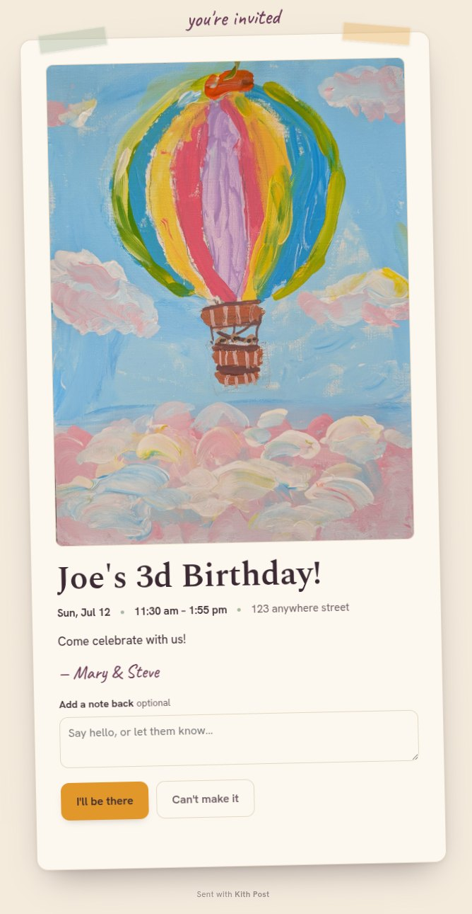

# Kith Post

[](https://github.com/iliabaranov/kith-post/actions/workflows/ci.yml)
&nbsp;License: MIT &nbsp;·&nbsp; Python 3.12 · FastAPI · SQLite

A free, self-hosted, privacy-first digital invitation service. Upload a card,
pick your people, and send a personal invite **from your own Gmail** — with
open / accept / decline tracking. A non-commercial alternative to Punchbowl and
Paperless Post.

**Live instance:** [kithpo.st](https://kithpo.st) — a running example. The landing
page is public; sign-in is invite-only (trusted circle), so it's a look at the real
thing rather than an open sandbox.

<p align="center">
  
  <br>
  <em>What a recipient sees — the emailed invitation, opened in the browser.</em>
</p>

> **Status:** functional and self-hostable end to end — Google sign-in, card
> compose, Gmail send with open/RSVP tracking, automated reminders, a contacts
> address book, and an opt-in WhatsApp channel are all in place. See [`DESIGN.md`](./DESIGN.md) for the
> architecture/roadmap and [`DESIGN-LANGUAGE.md`](./DESIGN-LANGUAGE.md) for the
> visual system.

## Run it locally

Requires [uv](https://docs.astral.sh/uv/) and Python 3.12+.

```bash
make install      # create .venv + install deps (uv)
make dev          # http://localhost:8000  (hot reload)
make test         # pytest
make lint         # ruff
# or the container:
make docker       # docker compose up --build
```

The `Makefile` clears `PYTHONPATH` so a sourced ROS (or other system Python)
can't leak packages into the venv. Copy `config.example.toml` → `config.toml`
and `.env.example` → `.env` to override defaults; `KITH_SEND_MODE` defaults to
`dry-run` (no mail is sent — composed messages are written to `data/outbox/`).

**Signing in:** until you configure Google, `/auth/login` offers a local
**dev sign-in** so you can test the signed-in app. To enable real
"Sign in with Google", follow [`docs/google-oauth-setup.md`](./docs/google-oauth-setup.md)
and set `KITH_GOOGLE_CLIENT_ID`, `KITH_GOOGLE_CLIENT_SECRET`, and `KITH_FERNET_KEY`.

## What it does

- Sign in with Google (Gmail SSO).
- Upload an image to use as a holiday / birthday / event card.
- Build a list of family and friends.
- Send a personal email **from your own Gmail account** (via the Gmail API), so
  it looks like it came directly from you.
- Optionally send over **WhatsApp instead**, from your own WhatsApp account, via a
  self-hosted [WAHA](https://github.com/devlikeapro/waha) container — a short
  message with the same invitation link. Off by default; see the warning below.
- Collect RSVPs with an optional headcount (adults + kids), an allergies/dietary
  question, and a free-text note back.
- Track who was sent an invite, who opened it (visited the invitation page), and
  who accepted or declined — on a simple dashboard.
- Automatically follow up with non-responders on a sane, configurable schedule
  (halfway to the date, 1 week out, 3 days out) — reminders stop the moment
  someone engages.
- Keep a reusable address book, organized into groups (family, work, …) so you
  can add a whole circle to a card at once.
- Re-send an updated card and re-collect RSVPs when the date, time, or location
  changes.

## The WhatsApp channel (opt-in, and it carries real risk)

WhatsApp has no official way for an app to send from a personal account, so this
uses an **unofficial** client. That is against WhatsApp's terms of service, and a
linked account **can be restricted or banned**. Sending a few personal invitations
to people who already have your number is a world away from what gets accounts
banned — but the risk is real, and it's yours.

So the channel is off unless you turn it on (`KITH_WHATSAPP_ENABLED` plus the
`whatsapp` compose profile), and every host is warned in-app before they link
anything. Email invitations don't carry any of this.

What doesn't change: guests get the same `/i/{token}` invitation page, so opens,
RSVPs, headcount and reminders work identically — tracking lives on the page, not
in the delivery channel. Nothing is added to a WhatsApp message to track anyone.
Setup, and what to do when WhatsApp throttles an account, is in
[`docs/deploy.md`](./docs/deploy.md#5a-optional-the-whatsapp-channel-waha).

## Principles

- **Privacy first** — minimal data, PII encrypted at rest, one-click export &
  delete, heavy assets auto-purged. We use the `gmail.send` scope only and can
  never read your mailbox.
- **Self-hosted & free** — one container on your own hardware (two if you enable
  WhatsApp), exposed via a Cloudflare Tunnel with automatic HTTPS (no open router
  ports, works behind CGNAT). No paid dependencies, no monetization. See
  [`docs/deploy.md`](./docs/deploy.md).
- **Honest tracking, no pixel** — signals are Sent, Opened (= the recipient
  visited the invitation page), Accepted, and Declined. No hidden tracking pixel
  or beacons; "Opened" is an explicit page visit, never an inferred open — and
  never a robot's: link-preview crawlers and prefetches are excluded, since a chat
  app fetching the URL is what *sending* looks like, not what reading looks like.

## Stack

Python 3.12 · FastAPI · SQLite · Jinja2 (server-rendered) + hand-written vanilla JS
+ token-based CSS (light/warm, no framework) · Pillow · Google API client · httpx ·
Docker · Cloudflare Tunnel · WAHA (optional, for WhatsApp). Tested with pytest.

## License

MIT — provided **as is**, without warranty of any kind. See [`LICENSE`](./LICENSE).
